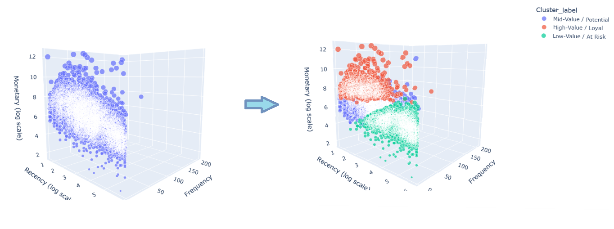
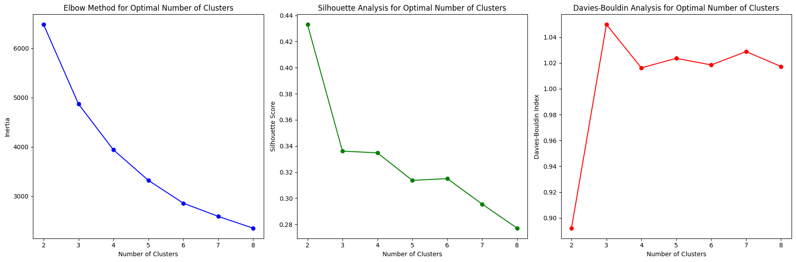
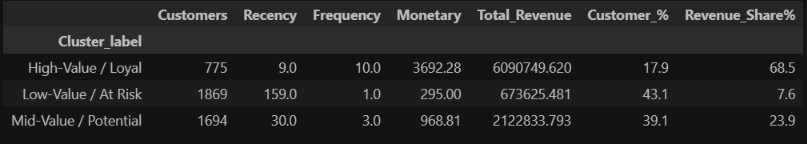
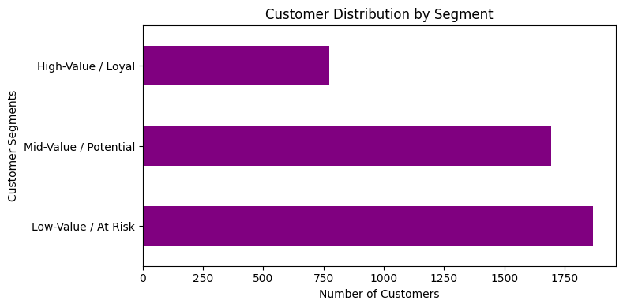
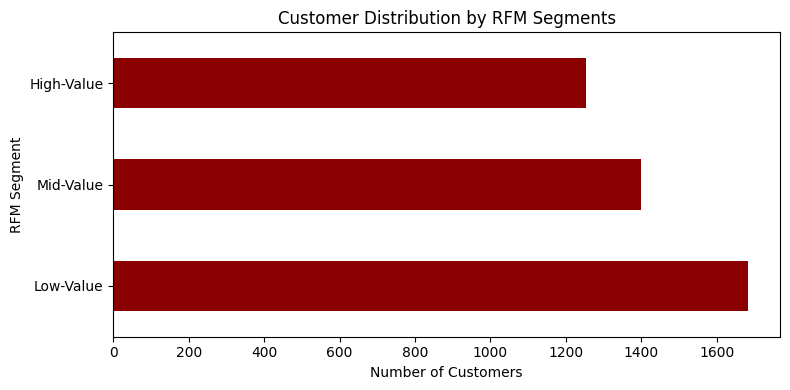
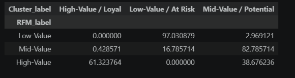
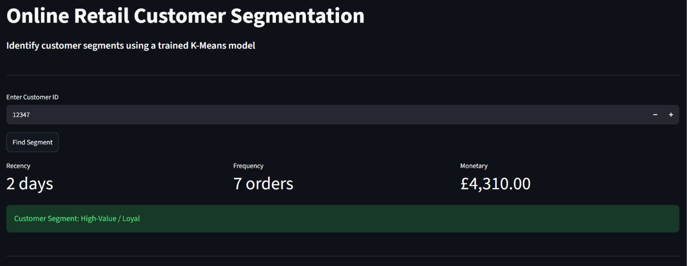
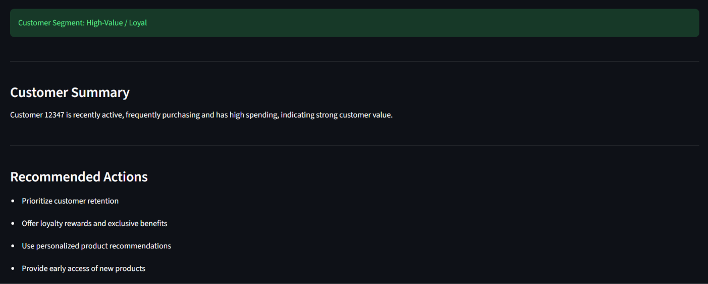

# Online Retail Customer Segmentation Project

## Overview

Customer segmentation helps businesses understand different types of customers based on their purchasing behavior. This project uses the **UCI Online Retail dataset** to analyze customer purchasing behavior and divide customers into meaningful segments.

The analysis combines **RFM (Recency, Frequency, Monetary) analysis** with **K-Means clustering** to identify groups of customers with similar purchasing patterns. The final segments are then translated into simple business actions that can help with customer retention, engagement, and reactivation.

A **Streamlit application** is also included where a Customer ID can be entered to calculate their RFM metrics, identify their segment and provide the business recommendations accordingly.

---

## Business Problem

Businesses often have customers with very different purchasing patterns. Treating every customer in the same way can result in inefficient marketing and missed retention opportunities.

This project helps businesses:

- Identify high-value and loyal customers
- Find customers with potential for increased engagement
- Find customers who may be at risk of becoming inactive
- Support targeted customer retention and marketing strategies

---

## Project Structure

```text
online-retail-customer-segmentation/
│
├── app/
│   ├── app.py
│
├── data/
│
├── images/
│
├── notebook/
│
└── README.md
```
---

## Dataset

The project uses the Online Retail dataset from the UCI Machine Learning Repository.

Dataset source:
https://archive.ics.uci.edu/dataset/352/online+retail

---
## Installations


### Clone the repository

```bash
git clone https://github.com/gravionic/online-retail-customer-segmentation.git
cd customer-segmentation
```

### Technologies

`Python` `Pandas` `NumPy` `Plotly` `Scikit-learn` `Streamlit` `Matplotlib` `Joblib` 

```bash
pip install pandas numpy plotly matplotlib scikit-learn streamlit joblib
```


---

## Project Workflow

```
Transaction Data
       ↓
Data Cleaning
       ↓
Exploratory Data Analysis
       ↓
RFM Feature Engineering
       ↓
Log Transformation
       ↓
Feature Scaling
       ↓
K-Means Clustering
       ↓
Cluster Evaluation
       ↓
Customer Segmentation
       ↓
Business Insights
       ↓
Appendix (Traditional RFM Segmentation)
       ↓
Streamlit Application
```
---

## RFM Analysis

Customer purchasing behavior was summarized using three RFM features:

- Recency – Days since the customer's last purchase
- Frequency – Number of unique orders
- Monetary – Total revenue generated by the customer

The RFM features were transformed and standardized before being used for K-Means clustering.

---
## K-Means Customer Segmentation

K-Means clustering was used to group customers based on their RFM behavior. Three clusters were selected for the final segmentation.

The resulting clusters were interpreted based on their RFM profiles and assigned business-friendly labels:
- High-Value / Loyal
- Mid-Value / Potential
- Low-Value / At Risk



---

## Model Evaluation

Since K-Means is an unsupervised learning algorithm, classification metrics like accuracy, precision, recall, and F1-score are not applicable here.
The clustering solution was evaluated using:
- Elbow Method
- Silhouette Analysis
- Davies-Bouldin Index

--- 

## Key Findings


| Customer Segment | Customer Share | Revenue Share |
|------------------|---------------:|--------------:|
| High-Value / Loyal | 17.9% | 68.5% |
| Mid-Value / Potential | 39.1% | 23.9% |
| Low-Value / At Risk | 43.1% | 7.6% |

High-Value / Loyal customers are in a relatively small portion of the customer base but contribute the majority of revenue.
Low-Value / At Risk customers represent the largest customer segment but contribute only a small portion of total revenue.

---

## RFM vs K-Means
Traditional RFM scoring was compared with the final K-Means segmentation.

### K-Means Segmentation


### RFM Segmentation


### Crosstab Comparison


The RFM approach gives relatively balanced segments as customers are divided based on their overall RFM score. K-Means does not impose equal group sizes and instead forms clusters according to similarities in the underlying RFM features.

---

## Streamlit Web Application


The application allows users to:
- Enter an existing Customer ID
- Calculate customer RFM metrics
- Identify the customer's segment
- View a customer summary
- Receive segment-specific recommendations

---

## Future Improvements

- Add customer purchase history visualizations
- Integrate continuously updated transaction data
- Explore alternative clustering techniques

---
## Author

Mohit

